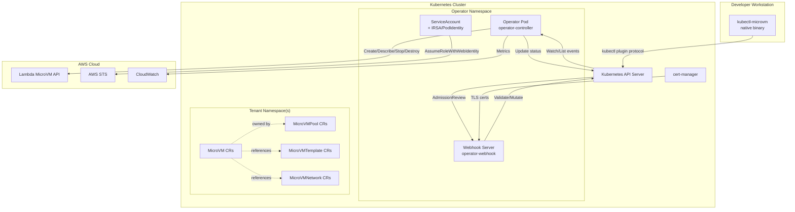
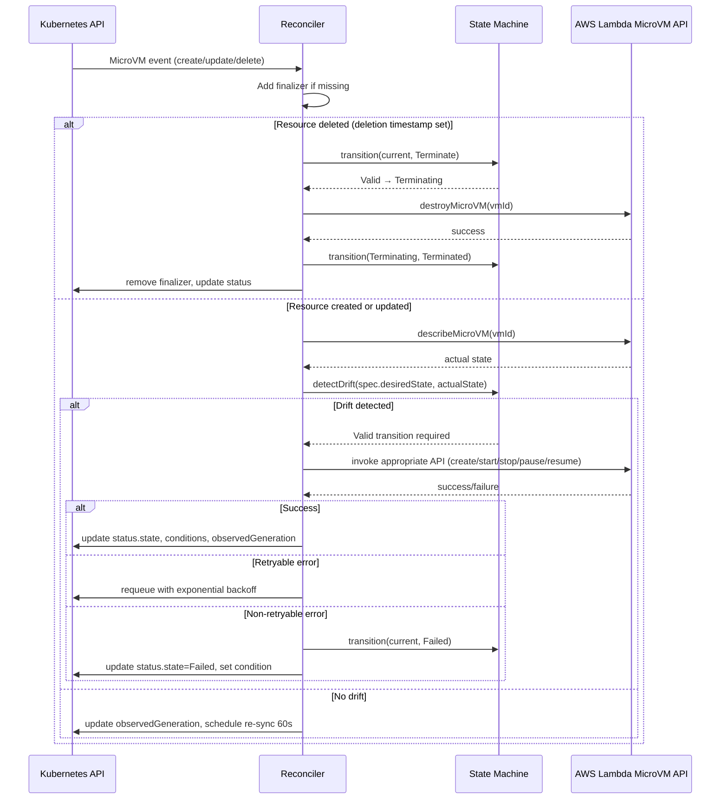
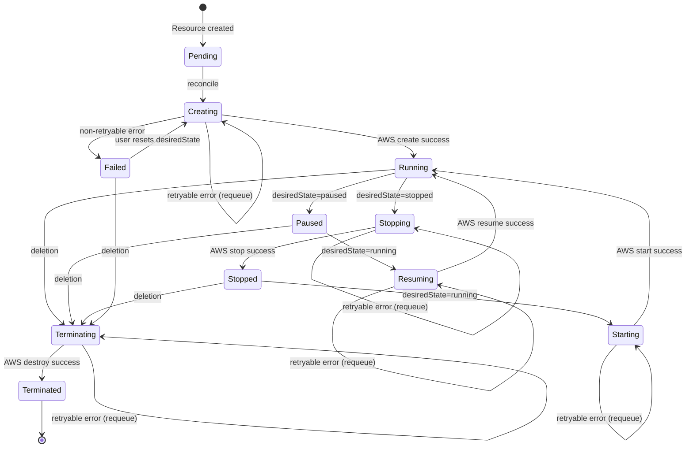
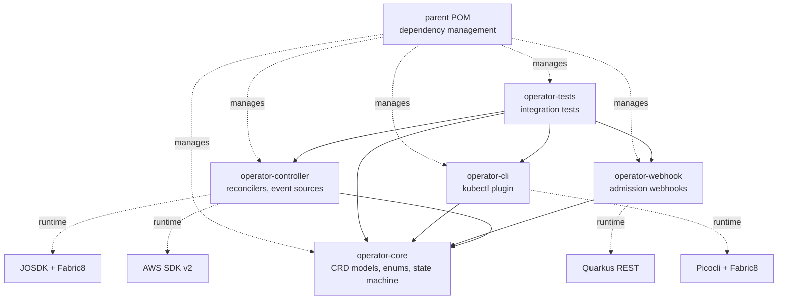

# Technical Design Document — Lambda VM ACK Operator

## Overview

The Lambda VM ACK Operator is a Kubernetes operator that manages AWS Lambda MicroVM (Firecracker-based) sandboxes following the AWS Controllers for Kubernetes (ACK) pattern. It reconciles four Custom Resource Definitions (CRDs) — `MicroVM`, `MicroVMPool`, `MicroVMTemplate`, and `MicroVMNetwork` — against AWS Lambda MicroVM APIs, providing full lifecycle control (create, start, stop, pause, resume, destroy) with drift detection and automatic correction.

The system is built in Java 25 on Quarkus 3.36.x using the Java Operator SDK (JOSDK) via `quarkus-operator-sdk`, Fabric8 Kubernetes Client for CRD modeling, AWS SDK v2 for cloud integration, and Picocli for a companion `kubectl-microvm` CLI plugin. Both operator and CLI compile to GraalVM native images for sub-second startup and minimal memory footprint.

### Design Goals

| Goal | Rationale |
|------|-----------|
| ACK-compatible pattern | Kubernetes-native UX for AWS resources |
| Sealed-interface state machine | Compile-time exhaustiveness checking for lifecycle states |
| Multi-module isolation | Independent build/test/deploy per concern |
| Native-first with JVM fallback | Production performance + dev ergonomics |
| Property-based correctness | Formal guarantees on serialization, state transitions, webhooks |

### Key Design Decisions

1. **JOSDK over raw informers** — Provides reconciler lifecycle, retry, dependent resources, and event filtering out of the box.
2. **Sealed interfaces for state machine** — Java 25 sealed types allow the compiler to enforce pattern completeness on state transitions.
3. **CDI-produced AWS clients** — Quarkus CDI allows context-aware credential resolution and per-resource region override.
4. **Fabric8 CRD generator** — Generates CRD YAML from annotated Java classes at build time, ensuring schema/model consistency.
5. **jqwik for PBT** — Mature JVM property-based testing library with Arbitrary combinators for complex domain objects.

---

## Architecture

### High-Level System Architecture



### Reconciliation Flow



### State Machine Diagram



### Module Dependency Graph



---

## Components and Interfaces

### Module: `operator-core`

This module contains zero Kubernetes/framework dependencies — only CRD model POJOs, enums, the state machine definition, and validation logic.

#### CRD Model Classes

```java
// MicroVM primary resource
@Group("lambda.aws.amazon.com")
@Version("v1alpha1")
@Kind("MicroVM")
@Singular("microvm")
@Plural("microvms")
@ShortNames("mvm")
public class MicroVM extends CustomResource<MicroVMSpec, MicroVMStatus>
    implements Namespaced {
}

@JsonInclude(JsonInclude.Include.NON_NULL)
public class MicroVMSpec {
    private String vmId;                          // optional, AWS-assigned
    @Required private Runtime runtime;            // enum
    @Required private Integer memoryMB;           // 128–10240, multiple of 64
    @Required private Integer vcpus;              // 1–6
    private Integer timeoutSeconds;               // 1–900, default 300
    private String networkRef;                    // reference name
    private String templateRef;                   // reference name
    private DesiredState desiredState;            // running|paused|stopped
    private String region;                        // per-resource region override
    private Map<String, String> tags;             // propagated to AWS
    @JsonAnySetter @JsonAnyGetter
    private Map<String, Object> additionalProperties = new LinkedHashMap<>();
}

@JsonInclude(JsonInclude.Include.NON_NULL)
public class MicroVMStatus {
    private MicroVMState state;                   // current state machine state
    private String vmId;                          // AWS-assigned identifier
    private String ipAddress;                     // assigned when Running
    private List<Condition> conditions;           // standard K8s conditions
    private Instant lastTransitionTime;
    private Long observedGeneration;
}
```

```java
// Pool resource
@Group("lambda.aws.amazon.com")
@Version("v1alpha1")
@Kind("MicroVMPool")
public class MicroVMPool extends CustomResource<MicroVMPoolSpec, MicroVMPoolStatus>
    implements Namespaced {
}

public class MicroVMPoolSpec {
    @Required private Integer replicas;           // 0–100
    @Required private MicroVMSpec template;       // embedded VM spec
    private Integer minReady;                     // default 1
    private Integer maxSurge;                     // default 1
}

public class MicroVMPoolStatus {
    private Integer readyReplicas;
    private Integer currentReplicas;
    private Integer desiredReplicas;
    private List<Condition> conditions;
    private Long observedGeneration;
}
```

```java
// Template resource
@Group("lambda.aws.amazon.com")
@Version("v1alpha1")
@Kind("MicroVMTemplate")
public class MicroVMTemplate extends CustomResource<MicroVMTemplateSpec, Void>
    implements Namespaced {
}

public class MicroVMTemplateSpec {
    private Runtime runtime;
    private Integer memoryMB;
    private Integer vcpus;
    private Integer timeoutSeconds;
    private Map<String, String> environment;
    private Map<String, String> labels;
}
```

```java
// Network resource
@Group("lambda.aws.amazon.com")
@Version("v1alpha1")
@Kind("MicroVMNetwork")
public class MicroVMNetwork extends CustomResource<MicroVMNetworkSpec, Void>
    implements Namespaced {
}

public class MicroVMNetworkSpec {
    @Required private String vpcId;
    @Required private List<String> subnetIds;          // 1–6
    @Required private List<String> securityGroupIds;   // 1–5
}
```

#### State Machine (Sealed Interface Pattern)

```java
public sealed interface StateTransitionResult {
    record Valid(MicroVMState from, MicroVMState to) implements StateTransitionResult {}
    record Invalid(MicroVMState from, MicroVMState attemptedTo, String reason) 
        implements StateTransitionResult {}
}

public enum MicroVMState {
    PENDING, CREATING, RUNNING, PAUSED, RESUMING, 
    STOPPED, STARTING, STOPPING, TERMINATING, TERMINATED, FAILED;
}

public final class MicroVMStateMachine {
    private static final Map<MicroVMState, Set<MicroVMState>> VALID_TRANSITIONS = Map.ofEntries(
        entry(PENDING,      Set.of(CREATING)),
        entry(CREATING,     Set.of(RUNNING, FAILED)),
        entry(RUNNING,      Set.of(PAUSED, STOPPING, TERMINATING)),
        entry(PAUSED,       Set.of(RESUMING, TERMINATING)),
        entry(RESUMING,     Set.of(RUNNING, FAILED)),
        entry(STOPPING,     Set.of(STOPPED, FAILED)),
        entry(STOPPED,      Set.of(STARTING, TERMINATING)),
        entry(STARTING,     Set.of(RUNNING, FAILED)),
        entry(TERMINATING,  Set.of(TERMINATED)),
        entry(FAILED,       Set.of(CREATING, TERMINATING))
    );
    
    public StateTransitionResult transition(MicroVMState current, MicroVMState target) { ... }
    public Set<MicroVMState> validTargets(MicroVMState current) { ... }
}
```

#### Enums

```java
public enum Runtime {
    JAVA21, PYTHON3_12, NODEJS20, CUSTOM;
    
    @JsonValue
    public String toValue() { return name().toLowerCase().replace('_', '.'); }
    
    @JsonCreator
    public static Runtime fromValue(String v) { ... }
}

public enum DesiredState {
    RUNNING, PAUSED, STOPPED;
}
```

---

### Module: `operator-controller`

#### MicroVM Reconciler

```java
@ControllerConfiguration(
    namespaces = WATCH_ALL_NAMESPACES,
    name = "microvm-reconciler",
    finalizerName = "lambda.aws.amazon.com/microvm-protection",
    retryConfiguration = @RetryConfiguration(
        maxAttempts = 5,
        initialInterval = 200,
        intervalMultiplier = 2.0
    )
)
public class MicroVMReconciler implements Reconciler<MicroVM>, Cleaner<MicroVM> {

    @Inject MicroVMClient awsClient;
    @Inject MicroVMStateMachine stateMachine;
    @Inject MeterRegistry meterRegistry;
    
    @Override
    public UpdateControl<MicroVM> reconcile(MicroVM resource, Context<MicroVM> context) {
        // 1. Ensure finalizer present
        // 2. Describe actual AWS state
        // 3. Detect drift
        // 4. Execute state transition
        // 5. Update status
        // 6. Schedule re-sync (60s)
    }
    
    @Override
    public DeleteControl cleanup(MicroVM resource, Context<MicroVM> context) {
        // 1. Transition to Terminating
        // 2. Call AWS destroy
        // 3. Return DeleteControl.defaultDelete() or reschedule
    }
}
```

#### MicroVMPool Reconciler

```java
@ControllerConfiguration(
    namespaces = WATCH_ALL_NAMESPACES,
    name = "microvmpool-reconciler",
    finalizerName = "lambda.aws.amazon.com/pool-protection"
)
public class MicroVMPoolReconciler implements Reconciler<MicroVMPool> {

    @Inject KubernetesClient kubernetesClient;
    
    @Override
    public UpdateControl<MicroVMPool> reconcile(MicroVMPool pool, Context<MicroVMPool> context) {
        // 1. List child MicroVMs by owner reference
        // 2. Compare current count to spec.replicas
        // 3. Scale up: create MicroVMs from template (max 5 per cycle)
        // 4. Scale down: delete most-recently-created first (max 5 per cycle)
        // 5. Update status.readyReplicas, currentReplicas, desiredReplicas
    }
}
```

#### AWS Client Interface

```java
public interface MicroVMClient {
    CompletableFuture<CreateMicroVMResponse> createMicroVM(CreateMicroVMRequest request);
    CompletableFuture<DescribeMicroVMResponse> describeMicroVM(String vmId);
    CompletableFuture<Void> startMicroVM(String vmId);
    CompletableFuture<Void> stopMicroVM(String vmId);
    CompletableFuture<Void> pauseMicroVM(String vmId);
    CompletableFuture<Void> resumeMicroVM(String vmId);
    CompletableFuture<Void> destroyMicroVM(String vmId);
}
```

#### CDI Producer for AWS Clients

```java
@ApplicationScoped
public class AwsClientProducer {

    @ConfigProperty(name = "aws.region", defaultValue = "us-east-1")
    String defaultRegion;
    
    @ConfigProperty(name = "aws.http.connectionTimeout", defaultValue = "5000")
    int connectionTimeout;
    
    @ConfigProperty(name = "aws.http.requestTimeout", defaultValue = "30000")
    int requestTimeout;

    @Produces @ApplicationScoped
    public LambdaMicroVMAsyncClient defaultClient() {
        return LambdaMicroVMAsyncClient.builder()
            .region(Region.of(defaultRegion))
            .credentialsProvider(DefaultCredentialsProvider.create())
            .httpClient(NettyNioAsyncHttpClient.builder()
                .connectionTimeout(Duration.ofMillis(connectionTimeout))
                .readTimeout(Duration.ofMillis(requestTimeout))
                .build())
            .overrideConfiguration(cfg -> cfg
                .retryPolicy(RetryPolicy.builder()
                    .numRetries(5)
                    .backoffStrategy(EqualJitterBackoffStrategy.builder()
                        .baseDelay(Duration.ofMillis(200))
                        .maxBackoffTime(Duration.ofSeconds(20))
                        .build())
                    .build()))
            .build();
    }
    
    @Produces @Dependent
    public MicroVMClient regionAwareClient(InjectionPoint ip) {
        // Resolves region from @MicroVMRegion qualifier or falls back to default
    }
}
```

---

### Module: `operator-webhook`

#### Validating Webhook Handler

```java
@Path("/validate-microvm")
@ApplicationScoped
public class MicroVMValidatingWebhook {

    @Inject KubernetesClient kubernetesClient;

    @POST
    @Consumes(MediaType.APPLICATION_JSON)
    @Produces(MediaType.APPLICATION_JSON)
    public AdmissionReview validate(AdmissionReview review) {
        MicroVMSpec spec = extractSpec(review);
        List<String> errors = new ArrayList<>();
        
        // Range validations
        if (spec.getMemoryMB() < 128 || spec.getMemoryMB() > 10240) errors.add(...);
        if (spec.getMemoryMB() % 64 != 0) errors.add(...);
        if (spec.getVcpus() < 1 || spec.getVcpus() > 6) errors.add(...);
        if (spec.getTimeoutSeconds() != null && 
            (spec.getTimeoutSeconds() < 1 || spec.getTimeoutSeconds() > 900)) errors.add(...);
        
        // Reference validation
        if (spec.getNetworkRef() != null) {
            validateNetworkRefExists(spec.getNetworkRef(), review.getRequest().getNamespace(), errors);
        }
        
        // Namespace quota check
        validateQuota(review.getRequest().getNamespace(), errors);
        
        return errors.isEmpty() ? allow(review) : deny(review, errors);
    }
}
```

#### Mutating Webhook Handler

```java
@Path("/mutate-microvm")
@ApplicationScoped
public class MicroVMMutatingWebhook {

    @POST
    @Consumes(MediaType.APPLICATION_JSON)
    @Produces(MediaType.APPLICATION_JSON)
    public AdmissionReview mutate(AdmissionReview review) {
        MicroVMSpec spec = extractSpec(review);
        List<JsonPatchOperation> patches = new ArrayList<>();
        
        // Apply defaults
        if (spec.getTimeoutSeconds() == null) {
            patches.add(JsonPatchOperation.add("/spec/timeoutSeconds", 300));
        }
        if (spec.getMemoryMB() == null) {
            patches.add(JsonPatchOperation.add("/spec/memoryMB", 512));
        }
        
        return patchResponse(review, patches);
    }
}
```

---

### Module: `operator-cli`

#### Root Command

```java
@TopCommand
@CommandLine.Command(
    name = "kubectl-microvm",
    mixinStandardHelpOptions = true,
    version = "1.0.0-SNAPSHOT",
    description = "kubectl plugin for AWS Lambda MicroVM management",
    subcommands = {
        CreateCommand.class,
        ListCommand.class,
        DescribeCommand.class,
        DeleteCommand.class,
        PauseCommand.class,
        ResumeCommand.class,
        StopCommand.class,
        StartCommand.class,
        LogsCommand.class,
        ExecCommand.class,
        PoolCommand.class
    }
)
@QuarkusMain
public class MicroVMCommand implements Runnable, QuarkusApplication {
    @Inject CommandLine.IFactory factory;
    
    @Override
    public int run(String... args) {
        return new CommandLine(this, factory).execute(args);
    }
}
```

#### Example Subcommand

```java
@CommandLine.Command(name = "create", description = "Create a new MicroVM")
public class CreateCommand implements Callable<Integer> {
    
    @CommandLine.Option(names = {"--runtime", "-r"}, required = true)
    private Runtime runtime;
    
    @CommandLine.Option(names = {"--memory", "-m"}, defaultValue = "512")
    private Integer memoryMB;
    
    @CommandLine.Option(names = {"--vcpus", "-c"}, defaultValue = "2")
    private Integer vcpus;
    
    @CommandLine.Option(names = {"--timeout", "-t"}, defaultValue = "300")
    private Integer timeoutSeconds;
    
    @CommandLine.Option(names = {"--namespace", "-n"}, defaultValue = "default")
    private String namespace;
    
    @CommandLine.Option(names = {"--name"}, required = true)
    private String name;
    
    @Inject KubernetesClient client;
    
    @Override
    public Integer call() {
        // Build MicroVM CR and create via Fabric8 client
        // Print table-formatted result
        return 0;
    }
}
```

---

### Helm Chart Structure

```
charts/lambda-vm-ack-operator/
├── Chart.yaml                    # apiVersion: v2, kubeVersion: ">=1.27.0-0 <1.33.0-0"
├── values.yaml                   # Configurable defaults
├── crds/
│   ├── microvms.lambda.aws.amazon.com.yaml
│   ├── microvmpools.lambda.aws.amazon.com.yaml
│   ├── microvmtemplates.lambda.aws.amazon.com.yaml
│   └── microvmnetworks.lambda.aws.amazon.com.yaml
├── templates/
│   ├── _helpers.tpl
│   ├── deployment.yaml           # Operator Deployment
│   ├── serviceaccount.yaml       # SA with IRSA annotation
│   ├── clusterrole.yaml          # Minimum permissions
│   ├── clusterrolebinding.yaml
│   ├── role-admin.yaml           # microvm-admin role
│   ├── role-editor.yaml          # microvm-editor role
│   ├── role-viewer.yaml          # microvm-viewer role
│   ├── service-webhook.yaml      # Webhook Service
│   ├── validatingwebhookcfg.yaml
│   ├── mutatingwebhookcfg.yaml
│   ├── certificate.yaml          # cert-manager Certificate (conditional)
│   ├── servicemonitor.yaml       # Prometheus ServiceMonitor (conditional)
│   ├── networkpolicy.yaml        # Egress restrictions
│   └── NOTES.txt
└── tests/
    └── test-connection.yaml
```

---

## Data Models

### MicroVM CRD Schema

| Field Path | Type | Constraints | Default | Description |
|------------|------|-------------|---------|-------------|
| `spec.vmId` | string | — | null (AWS-assigned) | AWS MicroVM identifier |
| `spec.runtime` | enum | java21, python3.12, nodejs20, custom | — | Runtime environment |
| `spec.memoryMB` | integer | 128–10240, multiple of 64 | 512 | Memory allocation |
| `spec.vcpus` | integer | 1–6 | — | Virtual CPU count |
| `spec.timeoutSeconds` | integer | 1–900 | 300 | Execution timeout |
| `spec.networkRef` | string | valid MicroVMNetwork name | null | Network config ref |
| `spec.templateRef` | string | valid MicroVMTemplate name | null | Template ref |
| `spec.desiredState` | enum | running, paused, stopped | running | Target lifecycle state |
| `spec.region` | string | valid AWS region | env default | Per-resource region |
| `spec.tags` | map[string]string | — | {} | Tags propagated to AWS |
| `status.state` | enum | all MicroVMState values | Pending | Current lifecycle state |
| `status.vmId` | string | — | — | AWS-assigned ID |
| `status.ipAddress` | string | — | — | Assigned IP when running |
| `status.conditions` | []Condition | — | [] | Standard K8s conditions |
| `status.lastTransitionTime` | datetime | — | — | Last state change time |
| `status.observedGeneration` | integer | — | — | Last processed generation |

### MicroVMPool CRD Schema

| Field Path | Type | Constraints | Default | Description |
|------------|------|-------------|---------|-------------|
| `spec.replicas` | integer | 0–100 | — | Desired pool size |
| `spec.template` | MicroVMSpec | — | — | Embedded VM template |
| `spec.minReady` | integer | ≥0 | 1 | Min VMs ready before healthy |
| `spec.maxSurge` | integer | ≥0 | 1 | Max VMs above replicas during scaling |
| `status.readyReplicas` | integer | — | 0 | VMs in Running state |
| `status.currentReplicas` | integer | — | 0 | Total child VMs |
| `status.desiredReplicas` | integer | — | 0 | Mirrors spec.replicas |
| `status.conditions` | []Condition | — | [] | Standard K8s conditions |
| `status.observedGeneration` | integer | — | — | Last processed generation |

### MicroVMTemplate CRD Schema

| Field Path | Type | Constraints | Default | Description |
|------------|------|-------------|---------|-------------|
| `spec.runtime` | enum | java21, python3.12, nodejs20, custom | — | Runtime |
| `spec.memoryMB` | integer | 128–10240 | — | Memory |
| `spec.vcpus` | integer | 1–6 | — | vCPUs |
| `spec.timeoutSeconds` | integer | 1–900 | — | Timeout |
| `spec.environment` | map[string]string | — | {} | Env vars |
| `spec.labels` | map[string]string | — | {} | Labels for created VMs |

### MicroVMNetwork CRD Schema

| Field Path | Type | Constraints | Default | Description |
|------------|------|-------------|---------|-------------|
| `spec.vpcId` | string | `vpc-[a-z0-9]+` | — | VPC identifier |
| `spec.subnetIds` | []string | 1–6 items | — | Subnet list |
| `spec.securityGroupIds` | []string | 1–5 items | — | Security group list |

### Kubernetes Condition Schema (shared)

| Field | Type | Description |
|-------|------|-------------|
| `type` | string | `Ready`, `Progressing`, `Degraded` |
| `status` | enum | `True`, `False`, `Unknown` |
| `reason` | string | Machine-readable reason code |
| `message` | string | Human-readable description |
| `lastTransitionTime` | datetime | When condition last changed |


---

## Correctness Properties

*A property is a characteristic or behavior that should hold true across all valid executions of a system — essentially, a formal statement about what the system should do. Properties serve as the bridge between human-readable specifications and machine-verifiable correctness guarantees.*

### Property 1: CRD Serialization Round Trip

*For any* valid CRD object (MicroVM, MicroVMPool, MicroVMTemplate, or MicroVMNetwork) with arbitrarily populated required and optional fields, serializing to JSON (or YAML) and then deserializing back SHALL produce an object that is `equals()` to the original.

**Validates: Requirements 1.2, 1.3, 1.5, 1.6, 1.8, 1.10, 13.1, 13.2, 13.6**

### Property 2: State Transition Validity

*For any* pair `(from, to)` drawn from the defined set of valid state transitions (e.g., Pending→Creating, Creating→Running, Running→Paused, Paused→Resuming, Resuming→Running, Running→Stopping, Stopping→Stopped, Stopped→Starting, Starting→Running, any→Terminating where applicable, Terminating→Terminated, transitional→Failed), invoking `stateMachine.transition(from, to)` SHALL return a `StateTransitionResult.Valid` containing the expected `from` and `to` states.

**Validates: Requirements 2.2, 2.3, 2.4, 2.5, 2.6, 2.7, 2.8, 2.9, 2.10, 2.14**

### Property 3: Invalid State Transitions Are Rejected

*For any* pair `(from, to)` where `to` is NOT in the set of valid targets for `from` (e.g., Pending→Running, Running→Creating, Terminated→Running, Terminating→Paused), invoking `stateMachine.transition(from, to)` SHALL return a `StateTransitionResult.Invalid` containing a non-empty reason string explaining why the transition is disallowed.

**Validates: Requirements 2.13, 2.14**

### Property 4: Webhook Range Validation

*For any* integer value for `memoryMB`, the validating webhook SHALL accept it if and only if `128 ≤ memoryMB ≤ 10240` AND `memoryMB % 64 == 0`. *For any* integer value for `vcpus`, the webhook SHALL accept it if and only if `1 ≤ vcpus ≤ 6`. *For any* string value for `runtime`, the webhook SHALL accept it if and only if it matches one of the defined enum values (java21, python3.12, nodejs20, custom). *For any* integer value for `timeoutSeconds`, when present, the webhook SHALL accept it if and only if `1 ≤ timeoutSeconds ≤ 900`.

**Validates: Requirements 5.1, 5.2, 5.3**

### Property 5: Webhook Mutation Applies Defaults

*For any* valid `MicroVMSpec` where `timeoutSeconds` is null, after applying the mutating webhook the resulting spec SHALL have `timeoutSeconds == 300`. *For any* valid `MicroVMSpec` where `memoryMB` is null, after applying the mutating webhook the resulting spec SHALL have `memoryMB == 512`. All other fields SHALL remain unchanged by the mutation.

**Validates: Requirements 5.5, 5.6**

### Property 6: Pool Scaling Invariant

*For any* `MicroVMPool` with `spec.replicas = N` and `spec.maxSurge = S`, after a complete reconciliation cycle: (a) the number of child `MicroVM` resources SHALL be in the range `[0, N + S]`, (b) every child SHALL carry the label `lambda.aws.amazon.com/pool-name` equal to the pool's name, (c) every child SHALL have an owner reference pointing to the pool, and (d) `status.readyReplicas` SHALL equal the count of children with `status.state == Running`.

**Validates: Requirements 6.1, 6.2, 6.4, 6.5, 6.6, 6.7**

### Property 7: Pool Scale-Down Order

*For any* `MicroVMPool` being scaled down from `N` replicas to `M` replicas (where `M < N`), the `(N - M)` child `MicroVM` resources selected for deletion SHALL be those with the most recent `metadata.creationTimestamp` values — i.e., the oldest VMs survive.

**Validates: Requirements 6.3**

### Property 8: Namespace Quota Enforcement

*For any* namespace with a `ResourceQuota` limiting `count/microvms.lambda.aws.amazon.com` to quota `Q`, and where the current count of `MicroVM` resources in that namespace is `C`, attempting to create a new MicroVM SHALL be rejected by the webhook if and only if `C ≥ Q`.

**Validates: Requirements 10.3**

### Property 9: CLI Output Format Consistency

*For any* valid `MicroVM` resource with populated spec and status fields, the output of `kubectl microvm list` SHALL render a row containing exactly the columns NAME, STATE, VM-ID, RUNTIME, MEMORY, AGE — where NAME matches `metadata.name`, STATE matches `status.state`, VM-ID matches `status.vmId`, RUNTIME matches `spec.runtime`, MEMORY matches `spec.memoryMB`, and AGE is a valid duration string.

**Validates: Requirements 7.2**

### Property 10: Unknown Fields Ignored on Deserialization

*For any* valid `MicroVM` resource JSON augmented with arbitrary unknown top-level or nested fields under `spec`, deserializing and then re-serializing the object SHALL preserve those unknown fields in the output JSON — ensuring forward-compatible schema evolution.

**Validates: Requirements 13.3**

### Property 11: Tag Propagation Completeness

*For any* `MicroVM` resource with a non-empty `spec.tags` map containing arbitrary key-value string pairs, the AWS `CreateMicroVM` request constructed by the reconciler SHALL include every tag from `spec.tags` without addition, removal, or modification of keys or values.

**Validates: Requirements 4.3 (implicit tag propagation), 6.4**

### Property 12: Drift Detection Correctness

*For any* pair `(desiredState, actualAwsState)` where `desiredState ≠ actualAwsState` and a valid transition path exists from `actualAwsState` to `desiredState`, the drift detection logic SHALL identify the drift and select the correct AWS API operation to move toward the desired state. When no valid transition path exists, drift detection SHALL signal an error.

**Validates: Requirements 3.4, 3.5**

---

## Error Handling

### AWS API Error Handling

| Error Category | HTTP Status / SDK Exception | Operator Behavior |
|---------------|---------------------------|-------------------|
| Throttling | `TooManyRequestsException`, 429 | Remain in current state, requeue with exponential backoff (base 200ms, max 5 retries) |
| Transient | `ServiceException` (5xx), `SdkClientException` (timeout) | Remain in current state, requeue with backoff |
| Not Found | `ResourceNotFoundException` | Transition back to `Creating` — resource disappeared out-of-band |
| Conflict | `ConflictException` (409) | Re-read actual state from AWS, re-evaluate drift |
| Auth failure | `StsException`, credential expiry | Set `Ready` condition to `False` with reason `AWSAuthError`, requeue after 30s |
| Validation | `ValidationException` (400) | Transition to `Failed`, record error in conditions — non-retryable |
| Quota exceeded | `ResourceQuotaExceededException` | Transition to `Failed` with reason `AWSQuotaExceeded` |

#### Error Response Flow

```mermaid
flowchart TD
    A[AWS API Call] --> B{Response?}
    B -->|Success| C[Apply state transition]
    B -->|Retryable 429/5xx/timeout| D[Keep current state]
    D --> E[Requeue: backoff = min(200ms * 2^attempt, 20s)]
    B -->|ResourceNotFound| F[Transition to Creating]
    B -->|Non-retryable 400/403| G[Transition to Failed]
    G --> H[Set condition: reason=error code, message=details]
    B -->|Auth failure| I[Set Ready=False, reason=AWSAuthError]
    I --> J[Requeue after 30s]
```

### Kubernetes API Error Handling

| Error Category | Scenario | Operator Behavior |
|---------------|----------|-------------------|
| Conflict (409) | Status update race with another controller | Re-read resource, re-apply status update |
| Not Found (404) | Resource deleted between read and update | Log warning, skip update (next reconcile will handle) |
| Forbidden (403) | RBAC misconfiguration | Log error, set health endpoint to unhealthy |
| API unavailable | Control plane unreachable | JOSDK framework handles reconnection with backoff |
| Watch disconnected | Network partition | JOSDK re-establishes watch, triggers full re-list |

### Webhook Error Handling

| Error Category | Scenario | Webhook Behavior |
|---------------|----------|-----------------|
| Validation failure | Field out of range | Return `AdmissionResponse.denied()` with all error messages aggregated |
| Reference not found | NetworkRef doesn't exist | Return denial: "MicroVMNetwork \<name\> not found in namespace \<ns\>" |
| Quota exceeded | Namespace limit reached | Return denial: "namespace quota exceeded: \<current\>/\<limit\> microvms" |
| Internal error in webhook | Unexpected exception | Validating: failurePolicy=Fail → API rejects. Mutating: failurePolicy=Ignore → pass through unmutated |
| TLS certificate expiry | cert-manager renewal gap | cert-manager auto-renewal with 30-day lead time; webhook unavailability triggers K8s failurePolicy |
| Deserialization error | Malformed AdmissionReview | Return 400 with error details, log at WARN level |

### Reconciler Error Recovery Matrix

| Current State | Error Type | Recovery Action |
|--------------|------------|-----------------|
| Creating | Retryable | Stay in Creating, requeue (exponential backoff) |
| Creating | Non-retryable | → Failed |
| Running | AWS describe fails (transient) | Keep Running status, requeue |
| Running | AWS describe returns NotFound | → Creating (recreate) |
| Stopping | Retryable | Stay in Stopping, requeue |
| Stopping | Non-retryable | → Failed |
| Starting | Retryable | Stay in Starting, requeue |
| Starting | Non-retryable | → Failed |
| Terminating | Retryable | Stay in Terminating, requeue |
| Terminating | Non-retryable | Log error, stay in Terminating, requeue (must not abandon cleanup) |
| Terminating | NotFound | → Terminated (already gone) |

---

## Testing Strategy

### Testing Pyramid

```
┌─────────────────────────────────────────┐
│         E2E (manual/CI)                 │  ← Real K8s cluster + AWS sandbox
├─────────────────────────────────────────┤
│     Integration Tests (operator-tests)  │  ← QuarkusTest + k8s-server-mock
├─────────────────────────────────────────┤
│   Property-Based Tests (jqwik)          │  ← 100+ iterations per property
├─────────────────────────────────────────┤
│       Unit Tests (JUnit 5 + Mockito)    │  ← Fast, isolated, per-module
└─────────────────────────────────────────┘
```

### Property-Based Testing (jqwik 1.9.x)

The operator uses **jqwik 1.9.x** as the property-based testing library. Each correctness property maps to one `@Property` test method with a minimum of 100 iterations (configured via `@Property(tries = 100)` or higher).

#### Property-to-Module Mapping

| Property | Module | Test Class | jqwik Arbitrary |
|----------|--------|-----------|-----------------|
| 1: CRD Serialization Round Trip | operator-core | `CrdSerializationProperties` | `MicroVMArbitrary`, `MicroVMPoolArbitrary`, `MicroVMTemplateArbitrary`, `MicroVMNetworkArbitrary` |
| 2: State Transition Validity | operator-core | `StateMachineProperties` | `ValidTransitionArbitrary` (generates from valid edge set) |
| 3: Invalid State Transitions Rejected | operator-core | `StateMachineProperties` | `InvalidTransitionArbitrary` (generates from complement of valid edges) |
| 4: Webhook Range Validation | operator-webhook | `WebhookValidationProperties` | `Arbitraries.integers()`, `Arbitraries.strings()` |
| 5: Webhook Mutation Defaults | operator-webhook | `WebhookMutationProperties` | `MicroVMSpecArbitrary` (with nulled optional fields) |
| 6: Pool Scaling Invariant | operator-controller | `PoolScalingProperties` | `MicroVMPoolArbitrary`, `ChildListArbitrary` |
| 7: Pool Scale-Down Order | operator-controller | `PoolScalingProperties` | `TimestampedChildListArbitrary` |
| 8: Namespace Quota Enforcement | operator-webhook | `QuotaEnforcementProperties` | `Arbitraries.integers().between(0, 200)` for quota/count |
| 9: CLI Output Format | operator-cli | `CliOutputProperties` | `MicroVMArbitrary` (full resource with status) |
| 10: Unknown Fields Preserved | operator-core | `CrdSerializationProperties` | `MicroVMArbitrary` + `Arbitraries.maps()` for unknown fields |
| 11: Tag Propagation | operator-controller | `TagPropagationProperties` | `Arbitraries.maps(Arbitraries.strings(), Arbitraries.strings())` |
| 12: Drift Detection | operator-controller | `DriftDetectionProperties` | `DesiredActualStatePairArbitrary` |

#### Tag Format

Each property test MUST include a descriptive tag comment:

```java
// Feature: lambda-vm-ack-operator, Property 1: CRD Serialization Round Trip
@Property(tries = 200)
void crdRoundTrip(@ForAll("validMicroVM") MicroVM microVM) { ... }
```

#### Example Arbitrary Combinator (jqwik)

```java
@Provide
Arbitrary<MicroVMSpec> validMicroVMSpec() {
    return Combinators.combine(
        Arbitraries.of(Runtime.values()),
        Arbitraries.integers().between(2, 160).map(i -> i * 64),   // memoryMB: 128–10240, multiple of 64
        Arbitraries.integers().between(1, 6),                       // vcpus
        Arbitraries.integers().between(1, 900).injectNull(0.3),    // timeoutSeconds (nullable)
        Arbitraries.strings().alpha().ofMinLength(1).ofMaxLength(20).injectNull(0.5), // networkRef
        Arbitraries.strings().alpha().ofMinLength(1).ofMaxLength(20).injectNull(0.5), // templateRef
        Arbitraries.of(DesiredState.values()).injectNull(0.2),     // desiredState
        validTagMap()
    ).as(MicroVMSpec::new);
}

@Provide
Arbitrary<Map<String, String>> validTagMap() {
    return Arbitraries.maps(
        Arbitraries.strings().alpha().ofMinLength(1).ofMaxLength(50),
        Arbitraries.strings().alpha().ofMinLength(0).ofMaxLength(100)
    ).ofMaxSize(10);
}
```

### Unit Tests (JUnit 5 + Mockito)

Unit tests complement property tests by covering specific examples, edge cases, and integration points:

| Module | Focus Areas | Key Test Classes |
|--------|------------|-----------------|
| operator-core | Enum serialization, default values, equals/hashCode contract, builder patterns | `MicroVMSpecTest`, `RuntimeEnumTest`, `MicroVMStateTest` |
| operator-controller | Reconciler logic with mocked AWS client, finalizer handling, event emission | `MicroVMReconcilerTest`, `MicroVMPoolReconcilerTest` |
| operator-webhook | Specific validation error messages, edge cases (boundary values) | `MicroVMValidatingWebhookTest`, `MicroVMMutatingWebhookTest` |
| operator-cli | Command parsing, error message formatting, exit codes | `CreateCommandTest`, `ListCommandTest`, `PoolCommandTest` |

### Integration Tests (operator-tests module)

```java
@QuarkusTest
@WithKubernetesTestServer  // JOSDK test framework
class MicroVMReconcilerIT {
    
    @Inject KubernetesClient client;
    @Inject Operator operator;
    
    @Test
    void shouldTransitionFromPendingToRunning() {
        // Given: mock AWS createMicroVM returns success
        // When: create MicroVM CR
        // Then: status.state progresses Pending → Creating → Running
    }
    
    @Test
    void shouldHandleAwsThrottling() {
        // Given: mock AWS returns TooManyRequestsException
        // When: reconciler runs
        // Then: state remains unchanged, requeue scheduled
    }
    
    @Test
    void shouldDetectAndCorrectDrift() {
        // Given: MicroVM in Running state, AWS describe returns Stopped
        // When: reconciler runs
        // Then: start API called, state → Starting → Running
    }
}
```

### Test Configuration

| Setting | Value |
|---------|-------|
| jqwik version | 1.9.x |
| Minimum property tries | 100 (200 for serialization properties) |
| JUnit 5 version | 5.10.x (managed by Quarkus BOM) |
| Mockito version | 5.x (managed by Quarkus BOM) |
| K8s server mock | `io.fabric8:kubernetes-server-mock` |
| CI native test | Full integration suite against native binary |
| Coverage target | 80% line coverage on operator-core, 70% on other modules |

### Test Execution

- **Unit + Property tests**: `mvn test` (runs per-module, ~30s)
- **Integration tests**: `mvn verify -pl operator-tests` (requires docker for testcontainers, ~2min)
- **Native integration**: `mvn verify -Pnative-tests` (builds native image + runs integration suite, ~5min)
- **All tests use `--batch-mode`** for CI reproducibility
